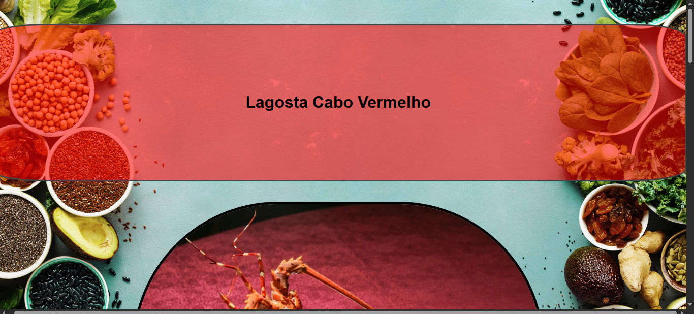
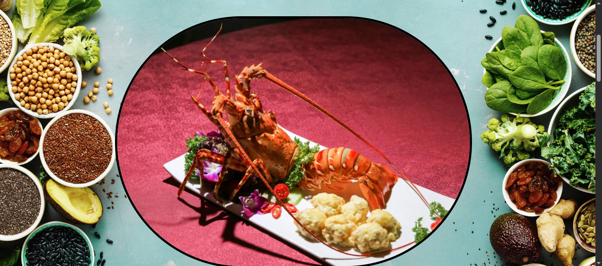
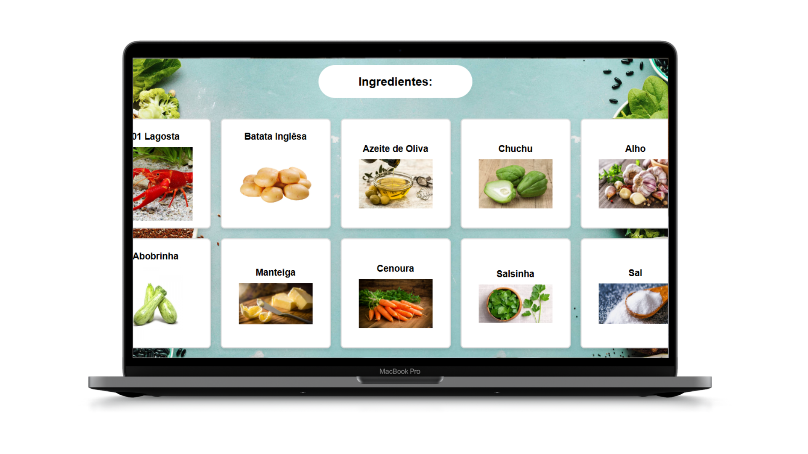
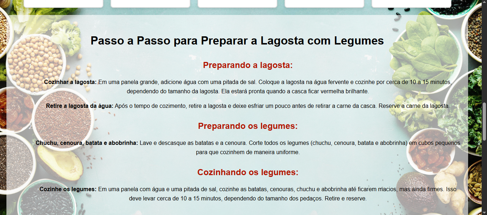
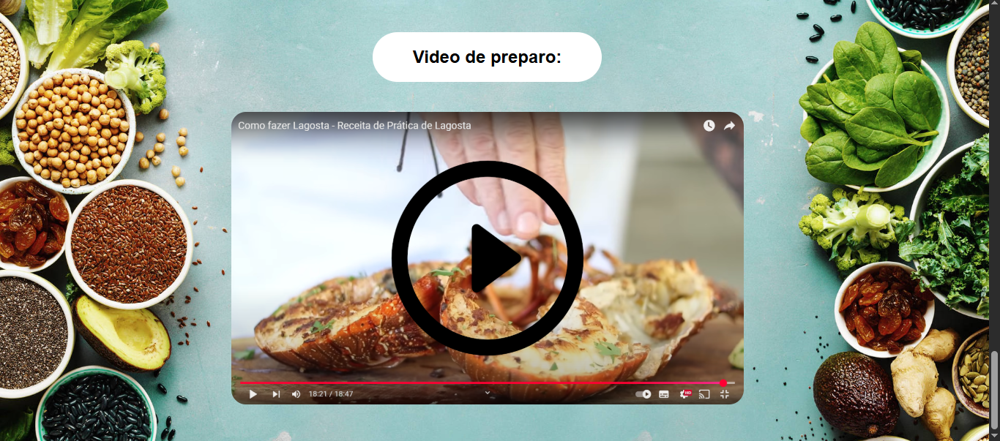

# Projeto de Site de Receitas

Bem-vindo ao meu projeto de **Site de Receitas**, desenvolvido com HTML e CSS! Este site tem como objetivo exibir uma receita de forma clara e interativa, demonstrando minhas habilidades em desenvolvimento web utilizando **HTML** para estruturação e **CSS** para o design e layout responsivo.

Este projeto é um exemplo de como as habilidades em **HTML5** e **CSS3** podem ser aplicadas para criar uma página web simples, mas elegante e funcional. É uma página que foca em apresentar um passo a passo de uma receita de forma limpa, com um design visualmente agradável, e utilizando boas práticas de acessibilidade.

## 💻 Tecnologias Utilizadas

- **HTML5**: Para estruturar a página e os elementos de conteúdo, como listas de ingredientes e etapas do preparo.
- **CSS3**: Para estilizar a página e tornar o design mais atraente e responsivo.
  - **Flexbox**: Utilizado para o layout da página, especialmente para organizar os ingredientes e as etapas do passo a passo.
  - **Transparência no fundo**: Para melhorar a legibilidade do texto em um fundo colorido ou complexo.
  - **Responsividade**: O design se adapta a diferentes tamanhos de tela, proporcionando uma boa experiência tanto em desktop quanto em dispositivos móveis.

### 🌐 Visual do Site 

O layout do site é baseado em um design simples e elegante, focado na legibilidade e funcionalidade. A estrutura principal inclui:

- **Lista de Ingredientes**: Uma lista interativa de ingredientes, onde cada item é apresentado com uma imagem correspondente.
- **Passo a Passo**: A receita é dividida em etapas organizadas de forma clara, para facilitar o acompanhamento durante o preparo.
- **Design Limpo e Funcional**: O uso de **Flexbox** e outras técnicas CSS mantém o site organizado, mesmo quando exibido em telas menores.

### Exemplos de Funcionalidade:

1. **Passo a Passo com Listagem Ordenada**: Um formato simples de listas ordenadas para mostrar as etapas da receita de forma clara.
2. **Imagens dos Ingredientes**: Cada ingrediente possui uma imagem associada para tornar o site mais visual e interativo.
3. **Layout Responsivo**: O design do site se ajusta automaticamente para dispositivos móveis e desktops.

##  Tela Cabeçalho:

##

##  Seção Ingredientes:

##  Seção Modo de Preparo:

## Seção video do preparo

